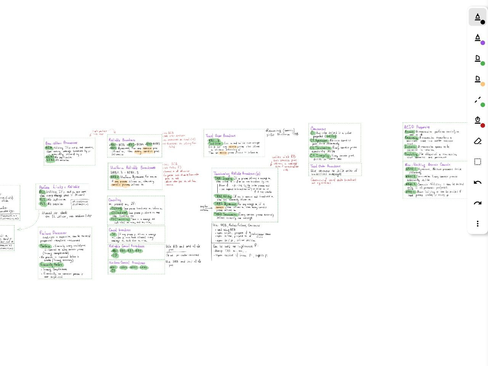
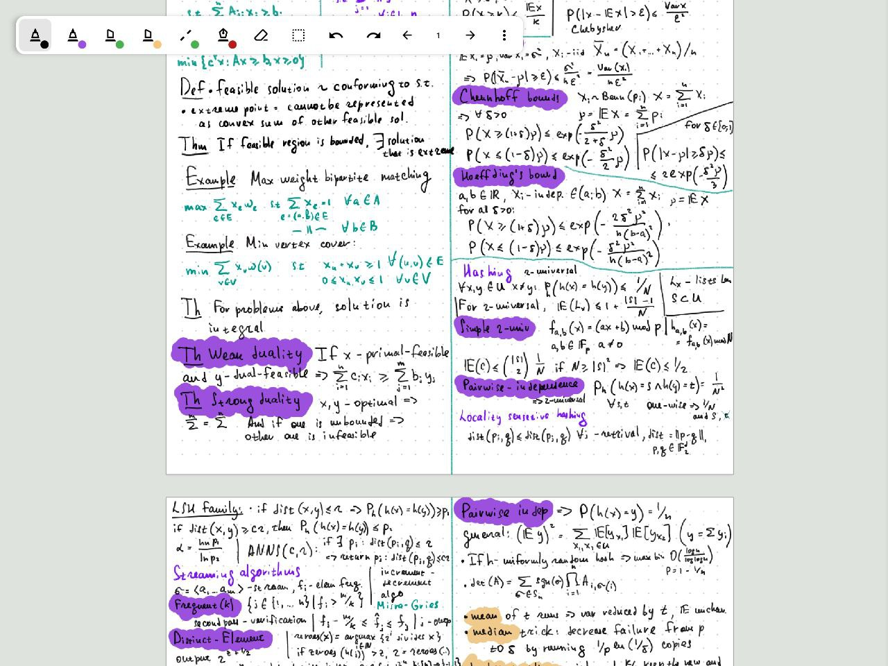

# Notate

**Beautiful High-Performance Infinite Canvas for Onyx Boox e-ink devices**

<p align="center">
    
    
</p>

## About Notate

Notate is an open-source note-taking application engineered specifically for **Onyx Boox E-Ink devices**.
The app implements a clean UI to streamline handwritten note-taking, with a focus on **performance** and **ergonomics**
without sacrificing extensive functionality.

## ✨ Features

| Feature | Description |
|---------|-------------|
| ⚡ **Zero-Latency Input** | Leverages the Onyx `EpdController` to write directly to the hardware frame buffer |
| ♾️ **Infinite Canvas** | An endless workspace with zoom from 1% to 1000% using tiles + level-of-detail optimizations |
| 📐 **Shape Recognition** | Draw and hold to snap rough strokes into perfect geometric shapes:  lines, triangles, rectangles, circles, pentagons, hexagons |
| 📄 **Backgrounds** | Blank, ruled, grid, or dots—customizable spacing, thickness, color, and padding |
| ✏️ **Scribble-to-Erase** | Quickly erase content by scribbling over it—detects zig-zag gesture density and velocity |
| 🧴 **Smart Erasers** | Stroke eraser, standard (partial) eraser, and lasso eraser modes |
| 📝 **Images** | Paste images seamlessly into the canvas |
| 🔲 **Selection** | Rectangle and lasso selection modes to select, copy, and move strokes or images |
| 🧭 **Fixed Pages Mode** | Page Mode emulation with visual grid and thumbnail navigation |
| 🎨 **Deep Customization** | Pen styles (Fountain, Ballpoint, Fineliner, Highlighter, Brush, Charcoal), colors, and stroke sizes |
| 🛠️ **Customizable Toolbar** | Add, remove, and reorder toolbar items; supports collapsible auto-hide mode |
| ⏪ **Undo/Redo** | Unlimited undo/redo history |
| 📁 **Project Organization** | File browser with projects, folders, thumbnails, rename, duplicate, and delete |
| 🗺️ **Minimap** | Overview minimap showing viewport position within the canvas |
| 📱 **Beautiful UI** | A clean, intuitive interface with floating toolbars and sidebar |
| 📐 **Drawing Aids** | Angle snapping and axis locking for precise lines |
| 📤 **Export & Share** | Export to PDF (vector or raster) and share directly |
| ☁️ **Cloud Sync** | Google Drive / WebDAV integration with optional PDF sync |

## 🎮 Gestures & Controls

### Stylus (Pen) Input
| Gesture | Action |
|---------|--------|
| **Draw** | Standard pen input |
| **Hold (Dwell)** | Triggers shape recognition (configurable) |
| **Scribble** | Triggers erase mode over scribbled area (configurable) |
| **Pen Button** | Toggle Eraser temporarily while held |
| **Eraser Tail** | Flip stylus to use eraser mode |

### Finger Gestures
| Gesture | Action |
|---------|--------|
| **Pan (1 finger)** | Drag to move the viewport |
| **Pinch (2 fingers)** | Zoom in and out |
| **Long Press on Object** | Select stroke or image, then drag to move |
| **Long Press on Empty Area** | Open paste/insert image menu |
| **Tap Outside Selection** | Deselect current selection |
| **Tap UI** | Interact with floating toolbar or sidebar |

### Selection Transforms (after selecting)
| Gesture | Action |
|---------|--------|
| **Drag Selection** | Move selected items |
| **Drag Corner Handle** | Scale selection from opposite corner |
| **Drag Rotation Handle** | Rotate selection with angle snapping (configurable) |
| **Two-Finger Pinch/Rotate** | Scale and rotate selection simultaneously |
---

## 📦 Installation

### Prerequisites

- **Device:** Onyx Boox (Android 11+ recommended)

### Relases

Download the latest APK from the [Releases](https://github.com/alexdremov/notate/releases) section and install it on your device.

### Build from Source

1. **Clone the repository:**
   ```bash
   git clone https://github.com/alexdremov/notate.git
   cd notate
   ```

2. **Build Debug APK:**
   ```bash
   ./gradlew app:assembleDebug
   ```
   APK will be at:  `app/build/outputs/apk/debug/app-debug.apk`

---

## 🏗️ Technical Architecture

For developers interested in E-Ink optimization, Notate employs several key patterns:

### Spatial Partitioning
Uses a **Quadtree** (`util/Quadtree.kt`) to manage stroke visibility, ensuring O(log N) query performance even with thousands of strokes.

### Ghosting Control
Automatically switches between eink different update mods to ensure smooth rendering on E-Ink displays.

### Tiled Rendering
The `TileManager` implements Level-of-Detail (LOD) with cached bitmap tiles, allowing smooth zooming across a virtually infinite canvas.

### Concurrency
Heavy tasks like tile generation and shape recognition run on dedicated `ThreadPoolExecutors` to keep the UI thread responsive.

### Key Classes

| Class | Purpose |
|-------|---------|
| `InfiniteCanvasModel` | Core data model with thread-safe stroke storage |
| `TileManager` | LOD-based tile caching and rendering |
| `Quadtree` | Spatial indexing for efficient stroke queries |
| `ShapeRecognizer` | Geometry recognition using Douglas-Peucker + competitive scoring |
| `ScribbleDetector` | Gesture analysis for scribble-to-erase |
| `PenInputHandler` | Input processing with dwell detection |

## 📄 License

This project is licensed under the MIT License - see the [LICENSE](LICENSE) file for details.

---

## 🙏 Acknowledgments

- [Onyx Boox SDK](https://github.com/onyx-intl/OnyxAndroidDemo) for E-Ink pen input APIs
- [Notable](https://github.com/Ethran/notable) for inspiration
- [HiddenApiBypass](https://github.com/LSPosed/AndroidHiddenApiBypass) for SDK restrictions workaround
